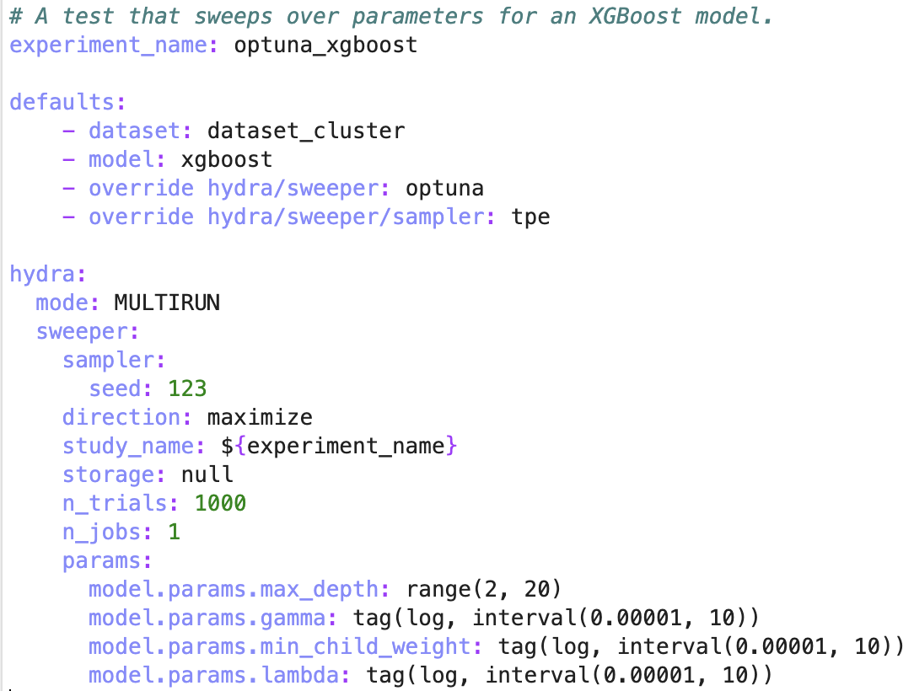

# RATTACA: A Streamlined Workflow to Facilitate Genome-Scale AI
The RATTACA project aims to use Whole Genome Sequencing data from a heterogenius stock of rats to identify variants that are linked to extreme phenotypes primarily related to physciatric behavior and addiction. The goal of this work is to provide a pipeline that accelerates the use of Machine Learning in Genome-Wide Association Studies (GWAS) by integrating the standard Genomics toolkits of Sgkit and Plink with the standard Machine Learning training toolkits of Sklearn, Hydra, MLFlow, and Optuna.  With this combination of toolkits from Genomics and Machine Learning, this repository offers a streamlined workflow for repetative training and evaluation of Machine Learning methods that aim to predict phenotypes from genotypes.  The results from various training runs can then be interactively visualized and assesed via the MLFlow user dashboard.  The following image summarizes the workflow.


## Setup

The training pipeline was built to use the following technologies:

<!-- table of requirements -->

The pipeline has been tested with Python 3.X. <!-- add python versions that work -->

This repository provides an environment file to setup a conda environment for running the training pipeline.

```
conda env create -f environment.yml
conda activate rattaca-venv
```

## Running the Trainer

This project uses hydra, the main entrypoint is training_pipeline.py

To run the default example run the following from the root directory

```
python training_pipeline.py
```

For an example running a custom config, try 

```
python training_pipeline.py --config-name=optuna_test
```
This runs config/optuna_test.yaml, an experiment using a Ridge Regression model.

See the folder `config/` for the list of our modeling experiment files. New experiments for new models can be run by creating a new config files and altering the parameter in the `--config-name` option.  The following describes how to go about configuring a specific trainining run.

### Step 1: Configuring the Data

Step 1 is to configure the training run to call a specific versions of the genotype and phenotype datasets. One will need to write a dataset conifg file in the `config/dataset` folder.  Adjust `geno_bed`, `geno_bim`, and `geno_fam` to call the specific LD pruned genotypes datasets and adjust `phenotypes` to call the specific phenotypes dataset.  Adjusting `select_traits` will limit to certain phenotypes. The `gwas_p_value` will adjust the variant reduction based on GWAS statistical association p-value to the input phenotypes, but this parameter can be swept when configuring an experiment.


### Step 2: Configuring the Model

Step 2 is to configure the training to call a specific type of Machine Learning model, such as an XGBoost. One will need to write a model config file in the `config/models` folder and establish the default hyperparameters that can be called or adjusted when configuring an experiment.  Adjust the `import_module` to call the python Machine Learning module.  Custom user defined models are permitted so long they have .fit and .predict.  Adjust `name` to call the specific model from the module, such as XGBRegressor from the xgboost python module.  Adjsut `params` according to the authorized hyperparameters of the model.


### Step 3: Configuring the Experiment

Step 3 is to configure the experiment by calling one of the dataset config files and one of the model config files along with a potential optimized sweep of hyperparameters via optuna.  One will ned to write an experiment config file in the `config` folder.  The name of this file will be passed to the `--config-name`command line argument.  The hyperparameters listed in the dataset config file (such as `gwas_p_value`) and the hyperparameters listed in the model config file can either be optimally swept over an interval or grid searched.



### Step 4: View the Experiment Results in MLFLow

The last step is viewing the results in the MLFLow server.  Evaluation results for each run through hyperparameter combinations can be viewed along with with visualizations for performance.


